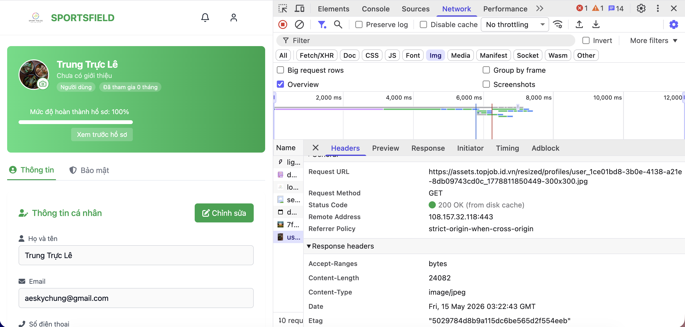

# MH4 Evidence — API Gateway Before Lambda

## Summary

MH4 triển khai một API surface tử tế trước Lambda resize ảnh của SportFields.

Trước MH4, backend không nên gọi Lambda trực tiếp vì thiếu API-level authentication, throttling và endpoint HTTP rõ ràng. Sau MH4, flow resize ảnh profile chạy qua API Gateway:

```text
User
-> CloudFront
-> ALB
-> EC2 Backend
-> API Gateway REST API POST /resize-image
-> Lambda sportfields-dev-resize-image
-> S3 resized/profiles/*
```

Function áp dụng là `sportfields-dev-resize-image`. Đây là function thật trong app, được dùng trong flow upload avatar profile cho user/owner. Backend gọi API Gateway bằng `RESIZE_IMAGE_API_URL` và `RESIZE_IMAGE_API_KEY`, thay vì invoke Lambda trực tiếp bằng AWS SDK.

## Deployment Details

| Hạng mục | Giá trị |
|---|---|
| Region | `us-east-1` |
| AWS account | `529715002875` |
| API type | REST API |
| API name | `sportfields-dev-resize-image-api` |
| API ID | `pa65zlcm48` |
| Stage | `prod` |
| Route | `POST /resize-image` |
| Invoke URL | `https://pa65zlcm48.execute-api.us-east-1.amazonaws.com/prod/resize-image` |
| Integration | Lambda Proxy Integration |
| Lambda function | `sportfields-dev-resize-image` |
| Authentication | API Key |
| API key name | `sportfields-dev-resize-image-key` |
| Usage plan | `sportfields-dev-resize-image-usage-plan` |
| Throttling | Rate `10 req/s`, burst `20` |
| S3 bucket | `sportfields-dev-529715002875-us-east-1-user-assets` |
| Output prefix | `resized/` |

REST API được chọn vì rubric yêu cầu API Key + Usage Plan throttling. REST API hỗ trợ API key và usage plan trực tiếp, rõ ràng hơn cho evidence so với HTTP API.

## Requirement Mapping

| Yêu cầu project | Trạng thái | Evidence |
|---|---:|---|
| API Gateway REST API hoặc HTTP API | Done | REST API `sportfields-dev-resize-image-api` |
| Ít nhất một route tích hợp Lambda | Done | `POST /resize-image` |
| Lambda Proxy Integration | Done | Integration request có `Lambda proxy integration = True` |
| Authentication chạy được | Done | API key required; thiếu key trả `403` |
| Throttling | Done | Usage plan rate `10`, burst `20` |
| App code gọi API Gateway URL thay vì invoke Lambda trực tiếp | Done | Backend response/log hiển thị `apiGatewayUrl` |
| Curl authenticated trả `200` | Done | `05-curl-200-with-api-key.png` |
| Curl unauthenticated trả `403` | Done | `06-curl-403-without-api-key.png` |

## Application Flow

Flow thật được dùng để resize avatar profile:

```text
POST /api/users/profile/image
POST /api/owners/profile/image
```

Backend nhận file avatar, upload object gốc lên S3, gọi API Gateway `POST /resize-image`, Lambda resize ảnh, rồi ghi object output vào:

```text
resized/profiles/...-300x300.jpg
```

Ngoài flow thật, project có endpoint admin để test evidence có kiểm soát:

```text
POST /api/admin/images/resize
```

Endpoint admin chỉ dùng để chứng minh backend gọi API Gateway; business flow chính là upload avatar profile của user/owner.

## Test Results

### Authenticated API Gateway request

Command test:

```bash
curl -i -X POST "$RESIZE_IMAGE_API_URL" \
  -H "x-api-key: $RESIZE_IMAGE_API_KEY" \
  -H "Content-Type: application/json" \
  -d '{"bucket":"sportfields-dev-529715002875-us-east-1-user-assets","key":"uploads/mh4-test.jpg","width":300,"height":300}'
```

Result:

```text
HTTP/2 200
outputKey: resized/uploads/mh4-test-300x300.jpg
```

### Unauthenticated API Gateway request

Command test:

```bash
curl -i -X POST "$RESIZE_IMAGE_API_URL" \
  -H "Content-Type: application/json" \
  -d '{"bucket":"sportfields-dev-529715002875-us-east-1-user-assets","key":"uploads/mh4-test.jpg","width":300,"height":300}'
```

Result:

```text
HTTP/2 403
{"message":"Forbidden"}
```

### Backend integration request

Command test:

```bash
curl -i -X POST "https://api.topjob.id.vn/api/admin/images/resize" \
  -H "Authorization: Bearer <ADMIN_TOKEN>" \
  -H "Content-Type: application/json" \
  -d '{"bucket":"sportfields-dev-529715002875-us-east-1-user-assets","key":"uploads/mh4-test.jpg","width":300,"height":300}'
```

Result:

```text
HTTP/2 200
apiGatewayUrl: https://pa65zlcm48.execute-api.us-east-1.amazonaws.com/prod/resize-image
outputKey starts with resized/
```

### Avatar profile regression

Profile upload result:

```text
success: true
resized: true
profileImageId: resized/profiles/...-300x300.jpg
```

CloudFront/assets read result:

```text
https://assets.topjob.id.vn/resized/profiles/...-300x300.jpg
HTTP/2 200
```

## Evidence Screenshots

### 01. API Gateway route

Shows REST API resource `/resize-image` with method `POST`.


### 02. Lambda proxy integration

Shows integration type `Lambda`, Lambda proxy integration `True`, and Lambda function `sportfields-dev-resize-image`.


### 03. API key required

Shows method request setting `API key required = True`. `Authorization = NONE` is expected here because the selected authentication mechanism is API Key.


### 04. Usage plan throttling

Shows usage plan `sportfields-dev-resize-image-usage-plan`, rate `10 requests per second`, burst `20 requests`, and associated enabled API key.


### 05. Curl 200 with API key

Shows authenticated request with `x-api-key` returning `HTTP/2 200`.


### 06. Curl 403 without API key

Shows unauthenticated request without `x-api-key` returning `HTTP/2 403`.


### 07. Backend calls API Gateway

Shows backend endpoint response proving EC2 Backend calls the API Gateway URL instead of directly invoking Lambda.


### 08. Lambda CloudWatch success

Shows Lambda CloudWatch log event `resize-image-completed` with input key `uploads/mh4-test.jpg` and output key `resized/uploads/mh4-test-300x300.jpg`.


### 09. S3 resized output object

Shows resized output object stored in S3 under the `resized/` prefix.


### 10. Profile avatar resized 200

Shows the real profile avatar flow reading a resized avatar from `assets.topjob.id.vn/resized/profiles/...-300x300.jpg` with status `200`.



## Final Statement

Website chính vẫn chạy qua CloudFront, ALB và EC2. Riêng chức năng resize ảnh được đưa ra sau API Gateway. EC2 Backend gọi HTTPS endpoint của API Gateway thay vì invoke Lambda trực tiếp. API Gateway enforce API Key authentication, usage plan throttling `10 req/s` burst `20`, và Lambda proxy integration trước Lambda Resize Image. Curl có API key trả `200`; curl thiếu API key trả `403`. Flow upload avatar profile của app cũng tạo và đọc được ảnh resized từ S3/CloudFront.
