# W5 Evidence Pack

## Cover

| | |
|---|---|
| **Group ID** | Nhóm 14 |
| **Link repo** | https://github.com/anons2003/sportfields |
| **Evidence Pack tuần trước** | https://github.com/Baronger23/Xbrain_evidence_package/blob/main/W4/W4_EVIDENCE_PACK.md|
**AWS Account:** `529715002875`  
**Region:** `us-east-1`  
**VPC:** `sportfields-dev-vpc` / `vpc-03fee4bca2c513e22`

---

## Kiến trúc tổng thể — Nhóm 14

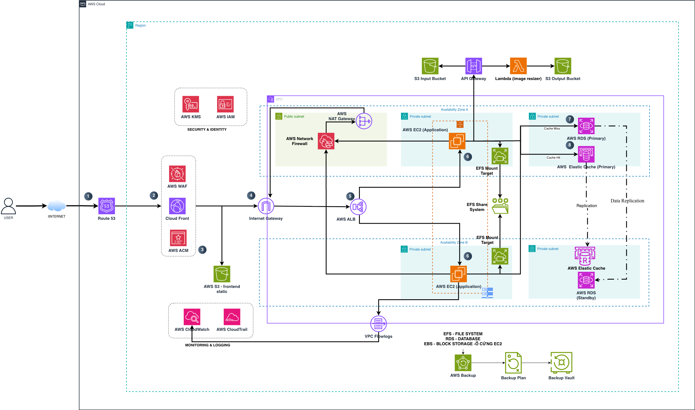

---

## MH1 — Multi-VPC Connectivity

📄 **Chi tiết đầy đủ:** [MH1_evidence.md](../W5/MH1_evidence.md)

### 1. Lựa chọn kiến trúc & Rationale

**Lựa chọn:** Path C - Justified Single-VPC

**Rationale:**  
Hiện tại ứng dụng SportFields đang ở giai đoạn đầu với một domain duy nhất, quy mô dữ liệu và người dùng nằm trong tầm kiểm soát. Các module (Web, API, Database) tương tác với nhau liên tục, do đó việc đặt tất cả trong một Single-VPC giúp tối ưu hóa độ trễ và tiết kiệm chi phí băng thông, thay vì phải duy trì Peering hay Transit Gateway.

Để đáp ứng tiêu chuẩn Production-ready, toàn bộ hạ tầng mạng được triển khai theo kiến trúc **Multi-AZ**. Các phân lớp mạng (Public, Private App, Private Data) đều được rải đều trên ít nhất 2 Availability Zones, đảm bảo High Availability nếu có sự cố ở cấp độ Data Center.

### 2. Các "Event kiến trúc" kích hoạt việc tạo VPC thứ 2

1. **Tách biệt môi trường (Environment Isolation):** Khi dự án bước vào Production chính thức, cần tách hoàn toàn môi trường Production và Dev/Staging. Môi trường Production sẽ được cấp phát ở VPC thứ 2 riêng biệt.
2. **Yêu cầu tuân thủ/bảo mật (Strict Security):** Khi tích hợp module thanh toán yêu cầu PCI DSS, module đó phải được cô lập trong VPC riêng với các lớp bảo mật khắt khe hơn.
3. **Cô lập tầng dữ liệu (Data Isolation):** Nếu ứng dụng mở rộng quy mô với lượng dữ liệu cực lớn, tầng Application và tầng Database sẽ được tách ra 2 VPC khác nhau.

> *Nhờ quản lý hạ tầng bằng **Terraform (IaC)**, khi cần thêm VPC chỉ cần nhân bản module và thay đổi tham số đầu vào, không cần cấu hình lại từ đầu.*

### 3. Screenshot Route Table

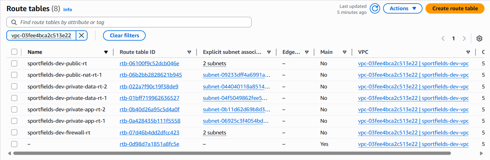

VPC `sportfields-dev-vpc` có các route table tách theo từng tầng mạng:

- `sportfields-dev-public-rt`
- `sportfields-dev-public-nat-rt-1`
- `sportfields-dev-private-app-rt-1` (AZ-a)
- `sportfields-dev-private-app-rt-2` (AZ-b)
- `sportfields-dev-private-data-rt-1`
- `sportfields-dev-private-data-rt-2`
- `sportfields-dev-firewall-rt`

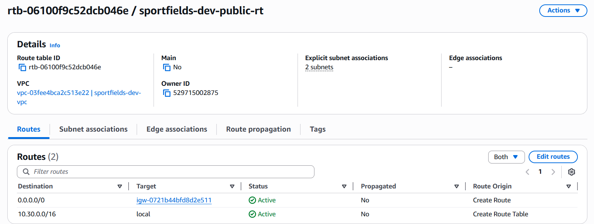

Public route table `sportfields-dev-public-rt`:

```
0.0.0.0/0    -> igw-0721b44bfd8d2e511
10.30.0.0/16 -> local
```

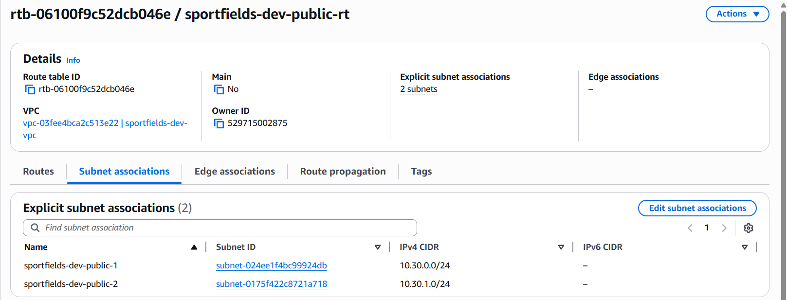

| Subnet | Tên | AZ | CIDR |
|---|---|---|---|
| `subnet-024ee1f4bc99924db` | `sportfields-dev-public-1` | `us-east-1a` | `10.30.0.0/24` |
| `subnet-0175f422c8721a718` | `sportfields-dev-public-2` | `us-east-1b` | `10.30.1.0/24` |

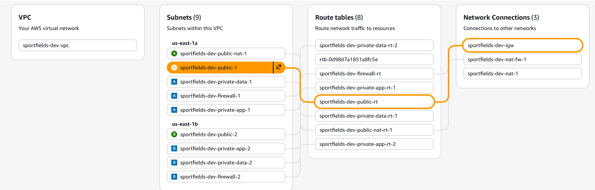

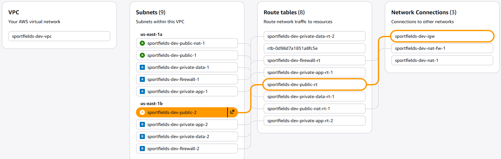

### 4. Sample VPC Flow Logs

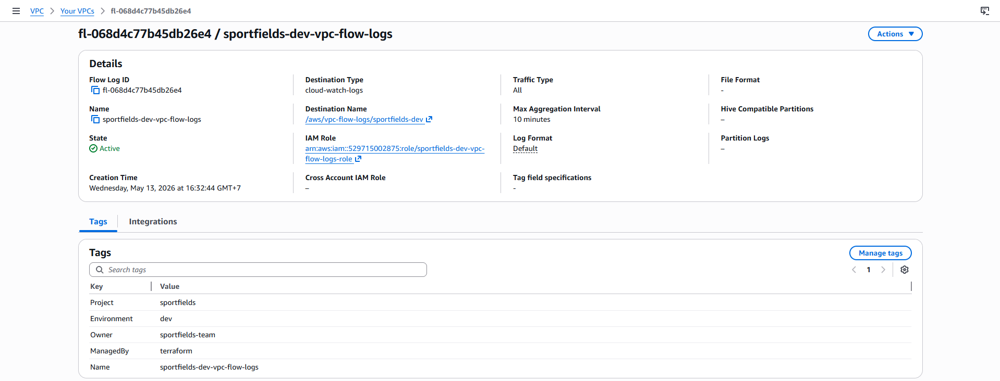

```
Flow Log ID:           fl-068d4c77b45db26e4
Name:                  sportfields-dev-vpc-flow-logs
State:                 Active
Destination type:      cloud-watch-logs
Destination name:      /aws/vpc-flow-logs/sportfields-dev
Traffic type:          All
Max aggregation:       10 minutes
Log format:            Default
```

**Sample Log Entry (ACCEPT):**

```
2 529715002875 eni-0472392bae7999168 10.30.11.193 10.30.20.106 36326 5432 6 16 2251 1778816712 1778816731 ACCEPT OK
```

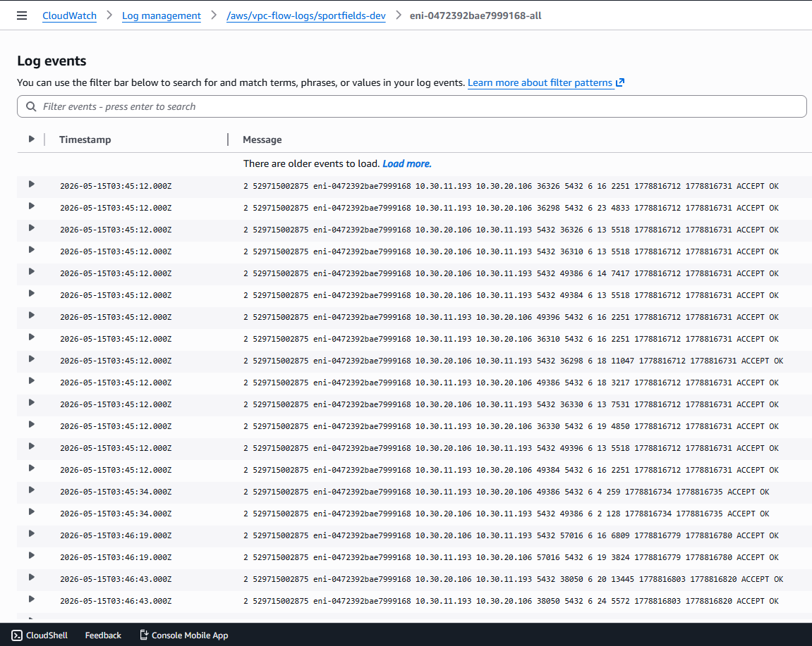

---

## MH2 — Firewall / Hardened SG+NACL

📄 **Chi tiết đầy đủ:** [MH2_evidence.md](../W5/MH2_evidence.md)

**Path đã chọn:** Path A — Deploy AWS Network Firewall

### Rationale

Backend EC2 chạy trong private application subnet và cần outbound internet thông qua NAT Gateway. Do EC2 có egress qua NAT, path hardened SG+NACL không hợp lệ cho MH2. Luồng traffic:

```
EC2 trong private-app subnet
-> Network Firewall endpoint (firewall subnet)
-> NAT Gateway (public NAT subnet)
-> Internet Gateway
-> Internet
```

### 1. Topology — Firewall Endpoints & Sync State

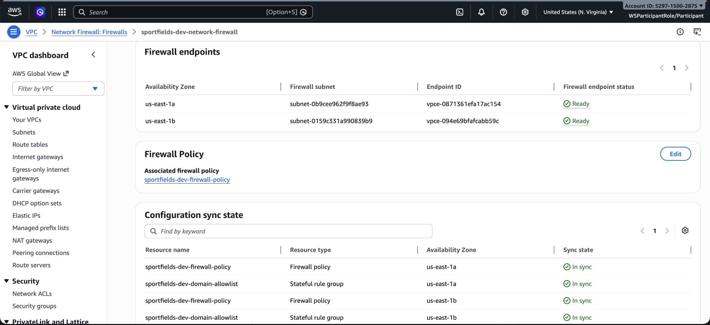

```
Firewall name:        sportfields-dev-network-firewall
Firewall status:      Ready
Firewall policy:      sportfields-dev-firewall-policy
Stateful rule group:  sportfields-dev-domain-allowlist
Config sync state:    In sync
```

| AZ | Firewall subnet | Endpoint ID | Status |
|---|---|---|---|
| `us-east-1a` | `subnet-0b9cee962f9f8ae93` | `vpce-0871361efa17ac154` | Ready |
| `us-east-1b` | `subnet-0159c331a990839b9` | `vpce-094e69bfafcabb59c` | Ready |

### 2. Firewall Policy

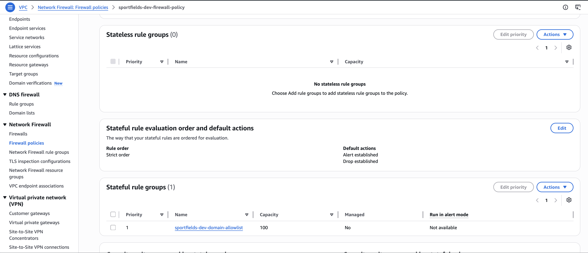

```
Firewall policy:              sportfields-dev-firewall-policy
Rule order:                   Strict order
Stateless default action:     Forward to stateful rule groups
Stateful default actions:     Alert established / Drop established
```

### 3. Stateful Domain Allowlist

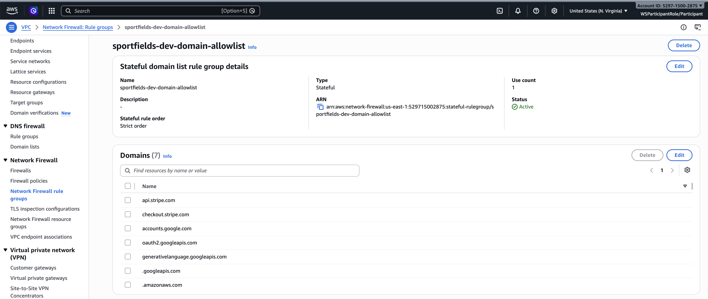

```
Name:    sportfields-dev-domain-allowlist
Type:    Stateful | Action: Allow | Protocols: HTTP, HTTPS
```

Domains được allow: `api.stripe.com`, `checkout.stripe.com`, `accounts.google.com`, `oauth2.googleapis.com`, `.googleapis.com`, `.amazonaws.com`

### 4. Route Tables

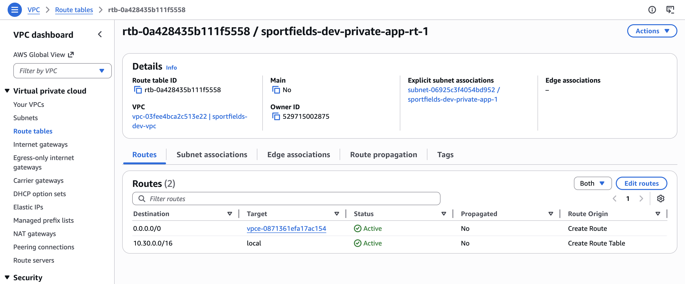

```
rtb sportfields-dev-private-app-rt-1 (us-east-1a)
0.0.0.0/0 -> vpce-0871361efa17ac154
```

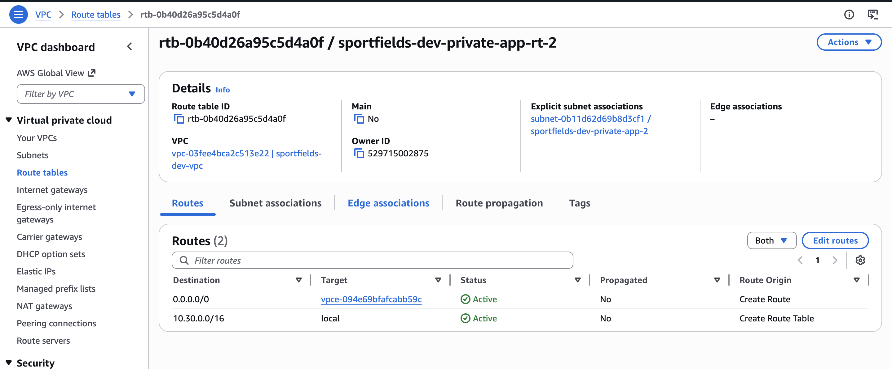

```
rtb sportfields-dev-private-app-rt-2 (us-east-1b)
0.0.0.0/0 -> vpce-094e69bfafcabb59c
```

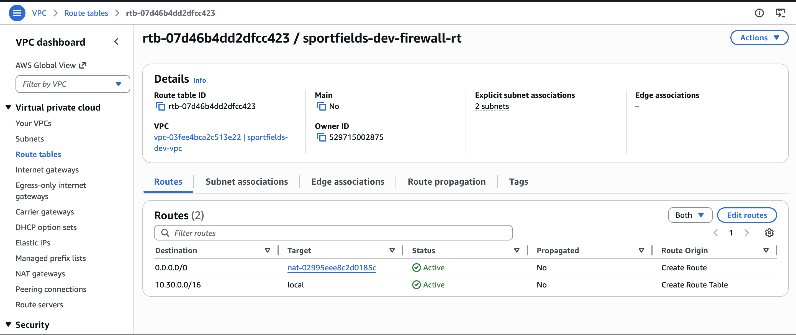

```
rtb sportfields-dev-firewall-rt
0.0.0.0/0 -> nat-02995eee8c2d0185c
```

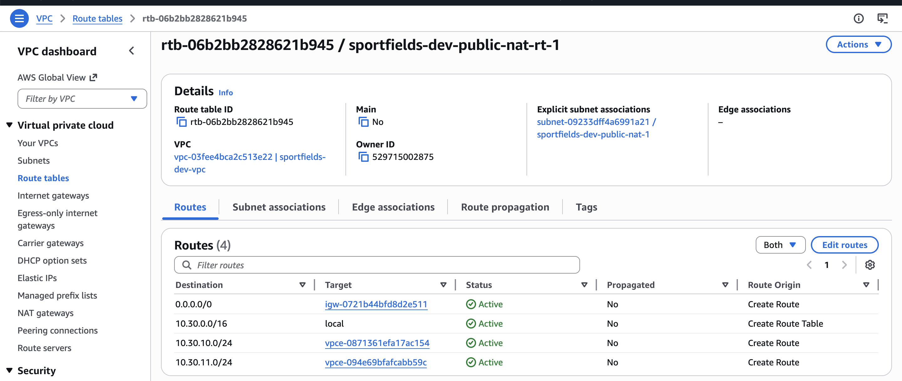

```
rtb sportfields-dev-public-nat-rt-1
10.30.10.0/24 -> vpce-0871361efa17ac154
10.30.11.0/24 -> vpce-094e69bfafcabb59c
0.0.0.0/0     -> igw-0721b44bfd8d2e511
```

### 5. Positive Test (Allowed)

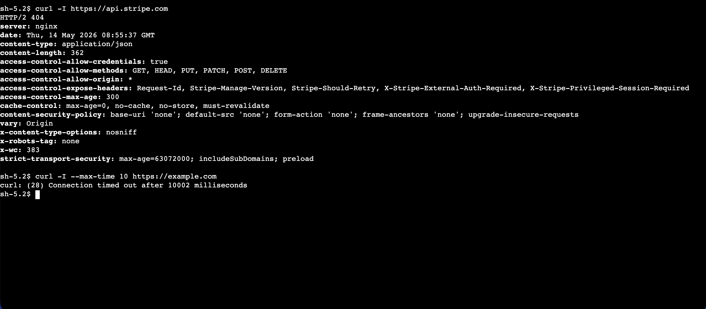

```bash
curl -I https://api.stripe.com
# Result: HTTP/2 404  (404 từ Stripe vì test root endpoint — request đã reach Stripe)
```

### 6. Negative Test (Blocked)

```bash
curl -I --max-time 10 https://example.com
# Result: curl: (28) Connection timed out after 10002 milliseconds
```

`example.com` không nằm trong domain allowlist nên bị AWS Network Firewall drop.

### 7. Alert Logs

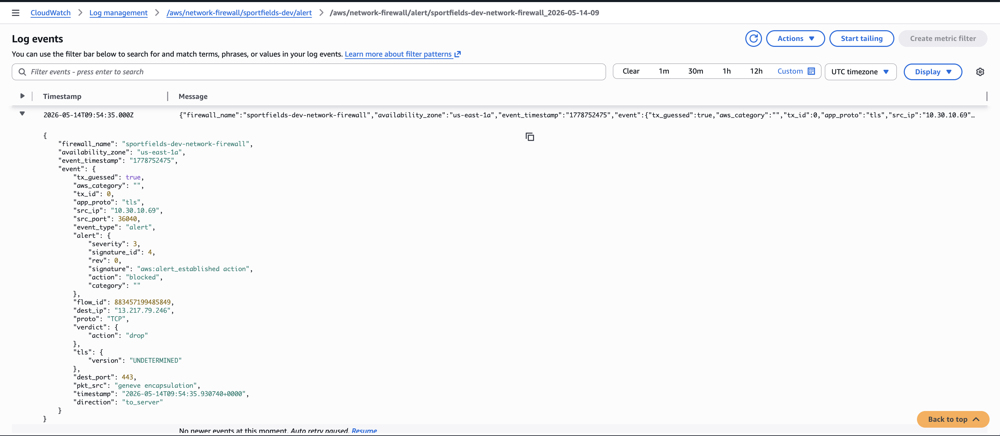

```
Log group: /aws/network-firewall/sportfields-dev/alert
src_ip: 10.30.10.69 | event_type: alert | alert.action: blocked
verdict.action: drop | proto: TCP | dest_port: 443
pkt_src: geneve encapsulation | direction: to_server
```

---

## MH3 — File Storage + Backup Plan

📄 **Chi tiết đầy đủ:** [MH3_evidence.md](../W5/MH3_evidence.md)

**Lựa chọn:** Amazon EFS Regional

### Rationale

Backend chạy trên Linux EC2 trong private application subnet. App cần shared file storage dạng NFS để nhiều app instance cùng truy cập khi scale. Nội dung lưu trên EFS là admin system report JSON được generate từ database live (users, fields, bookings, payments, revenue).

### 1. EFS File System

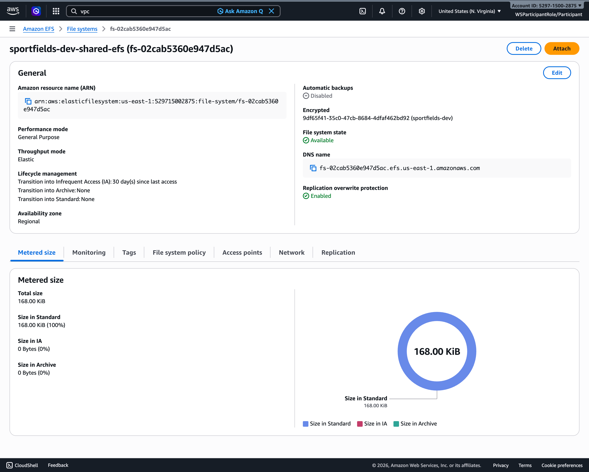

```
File system ID:    fs-02cab5360e947d5ac
Name:              sportfields-dev-shared-efs
Type:              Regional EFS
State:             available
Encrypted:         true
Performance mode:  generalPurpose
Throughput mode:   elastic
Mount path:        /mnt/sportfields-shared
```

### 2. Mount Targets

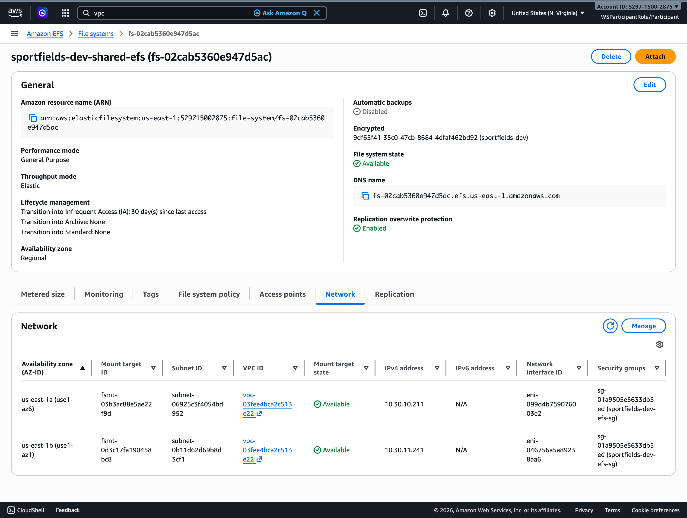

| AZ | Subnet | Subnet name | State |
|---|---|---|---|
| `us-east-1a` | `subnet-06925c3f4054bd952` | `sportfields-dev-private-app-1` | available |
| `us-east-1b` | `subnet-0b11d62d69b8d3cf1` | `sportfields-dev-private-app-2` | available |

### 3. Security Group

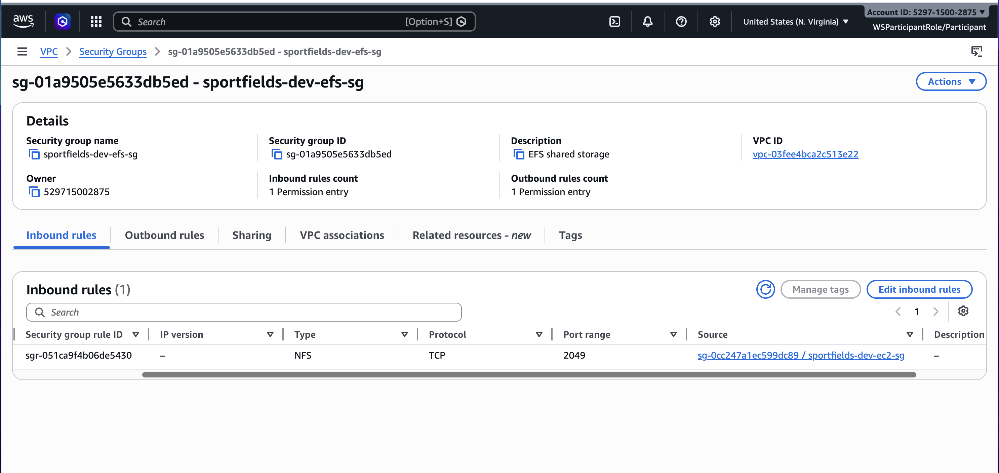

```
EFS SG: sg-01a9505e5633db5ed / sportfields-dev-efs-sg
Inbound: TCP 2049 from sg-0cc247a1ec599dc89 (sportfields-dev-ec2-sg) only
```

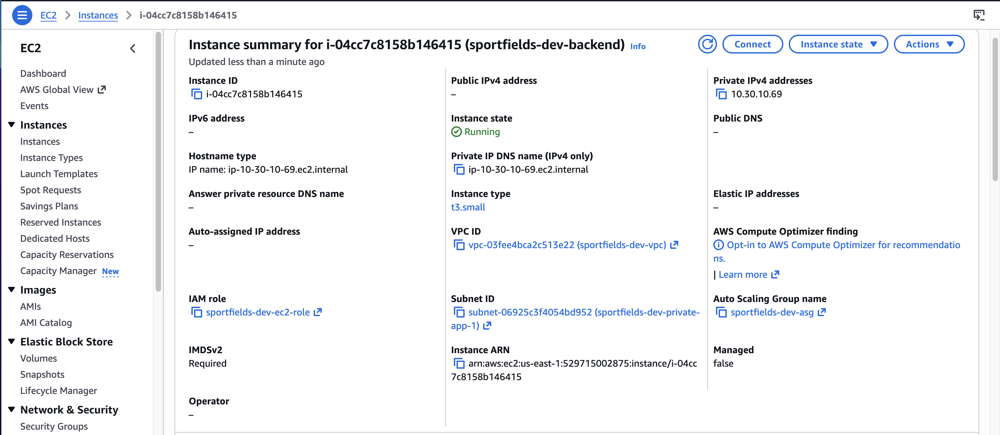

```
Instance ID:    i-04cc7c8158b146415
Name:           sportfields-dev-backend
Subnet:         subnet-06925c3f4054bd952 / sportfields-dev-private-app-1
Public IPv4:    none
```

### 4. App ghi & đọc file từ EFS

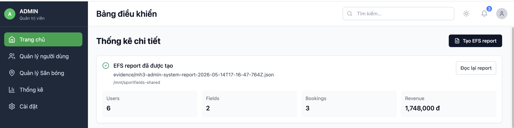

```
File: /mnt/sportfields-shared/evidence/mh3-admin-system-report-2026-05-14T17-16-47-764Z.json
```

| Metric | Value |
|---|---|
| Users | `6` |
| Fields | `2` |
| Bookings | `3` |
| Revenue | `1,748,000 VND` |

```bash
mountpoint /mnt/sportfields-shared
sudo cat /mnt/sportfields-shared/evidence/mh3-admin-system-report-2026-05-14T17-16-47-764Z.json | head -40
# /mnt/sportfields-shared is a mountpoint
# "type": "mh3-efs-admin-system-report"
```

### 5. AWS Backup Plan

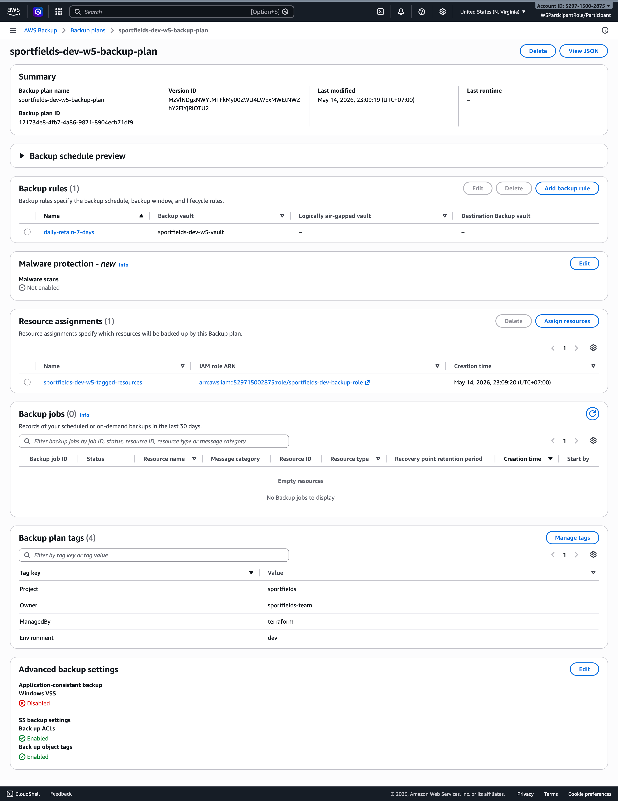

```
Backup plan:   sportfields-dev-w5-backup-plan
Rule:          daily-retain-7-days
Vault:         sportfields-dev-w5-vault
Schedule:      cron(0 18 * * ? *) — daily
Retention:     7 days
Tag selection: Backup = sportfields-w5
```

### 6. Recovery Points

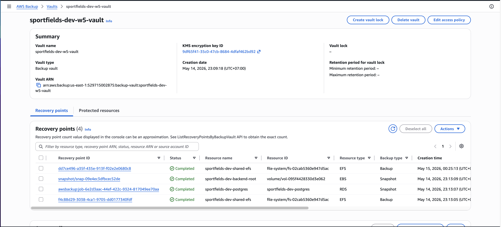

| Resource type | Resource | Status |
|---|---|---|
| EFS | `fs-02cab5360e947d5ac` | COMPLETED |
| RDS | `sportfields-dev-postgres` | COMPLETED |
| EBS | `vol-095f4428330d3e062` | COMPLETED |

### 7. Restore Test

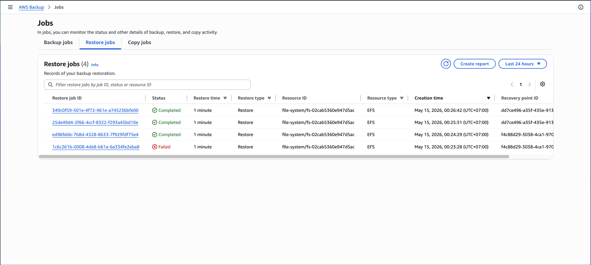

```
Restore job ID:    25de49d4-2f66-4ccf-8322-f293a45bd10e
Resource type:     EFS
Status:            Completed
Completion time:   2026-05-15 00:27:00 +07
```

### 8. Data đọc được từ resource đã restore

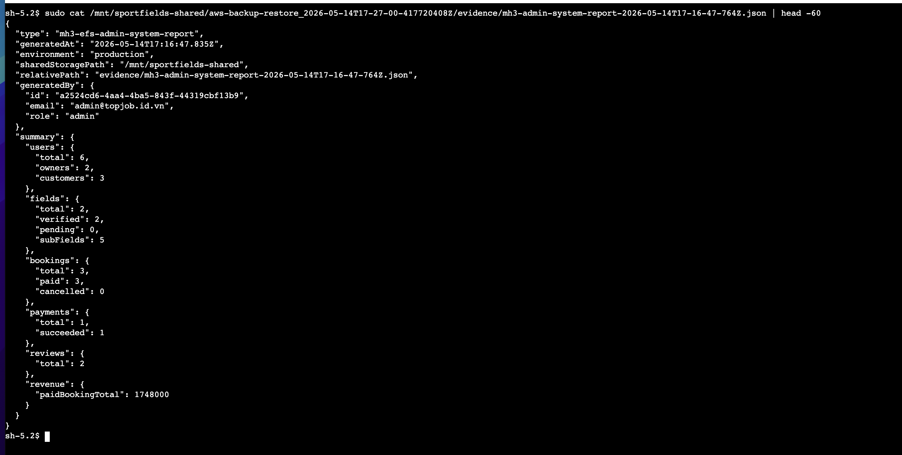

```bash
sudo cat /mnt/sportfields-shared/aws-backup-restore_2026-05-14T17-27-00-417720408Z/evidence/mh3-admin-system-report-2026-05-14T17-16-47-764Z.json | head -60
```

```json
{
  "type": "mh3-efs-admin-system-report",
  "environment": "production",
  "sharedStoragePath": "/mnt/sportfields-shared",
  "summary": {
    "users": { "total": 6 },
    "fields": { "total": 2 },
    "bookings": { "total": 3 },
    "revenue": { "paidBookingTotal": 1748000 }
  }
}
```

---

## MH4 — API Gateway

📄 **Chi tiết đầy đủ:** [MH4_evidence.md](../W5/MH4_evidence.md)

**Lựa chọn:** API Gateway REST API trước Lambda `sportfields-dev-resize-image`

### Rationale

REST API hỗ trợ API Key và Usage Plan rõ ràng, enforce throttling cho route serverless. Backend EC2 gọi API Gateway URL thay vì invoke Lambda trực tiếp.

```
User -> CloudFront -> ALB -> EC2 Backend
-> API Gateway REST API POST /resize-image
-> Lambda Resize Image -> S3 resized/*
```

### 1. Cây Resource

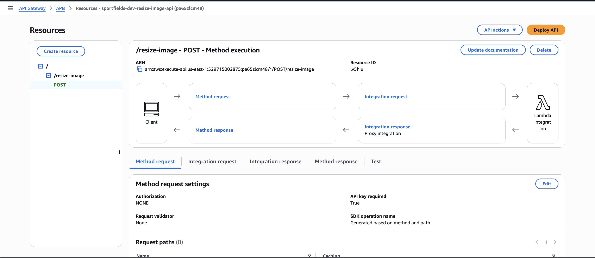

```
API:   sportfields-dev-resize-image-api
Stage: prod
Route: POST /resize-image
```

### 2. Lambda Proxy Integration

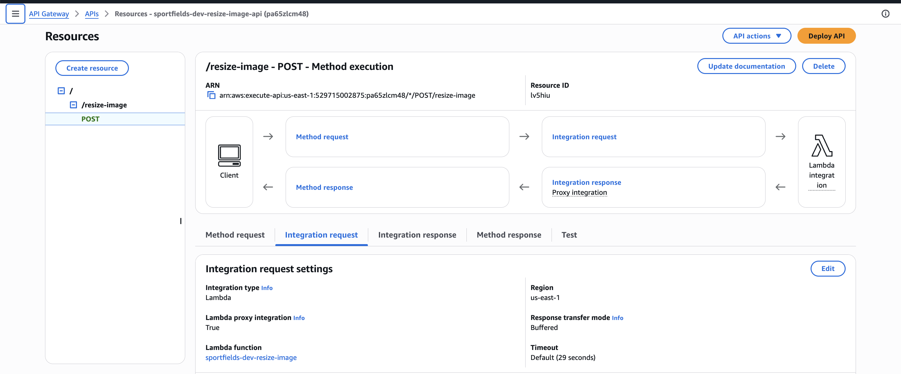

```
Integration type:  Lambda Proxy
Lambda function:   sportfields-dev-resize-image
Method:            POST
```

### 3. Cấu hình Auth (API Key Required)

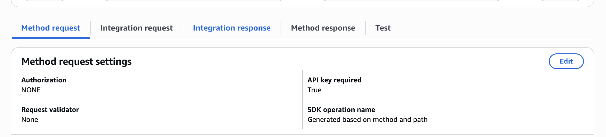

```
POST /resize-image
API Key Required: true
Authorization:    NONE
```

### 4. Usage Plan / Throttling

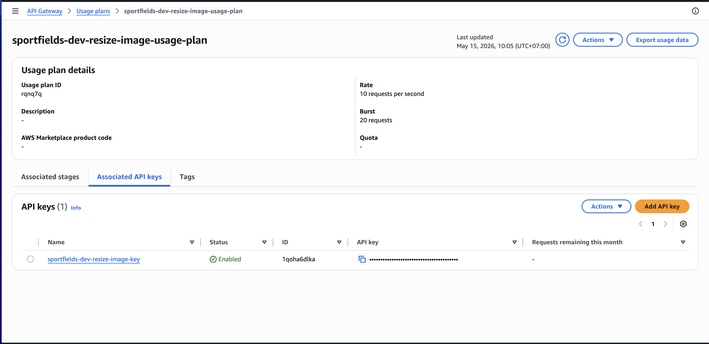

```
Usage plan:  sportfields-dev-resize-image-usage-plan
API key:     sportfields-dev-resize-image-key
Rate limit:  10 req/s
Burst limit: 20
Stage:       prod
```

### 5. Test curl 200 (có API key)

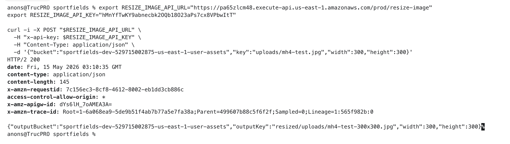

```bash
curl -i -X POST "$RESIZE_IMAGE_API_URL" \
  -H "x-api-key: $RESIZE_IMAGE_API_KEY" \
  -H "Content-Type: application/json" \
  -d '{"bucket":"sportfields-dev-529715002875-us-east-1-user-assets","key":"uploads/test.jpg","width":300,"height":300}'
# HTTP/2 200
# outputKey: resized/...
```

### 6. Test curl 403 (không có API key)

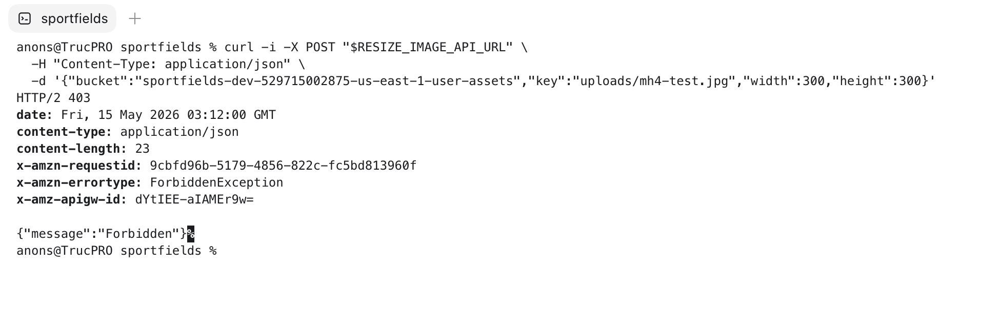

```bash
curl -i -X POST "$RESIZE_IMAGE_API_URL" \
  -H "Content-Type: application/json" \
  -d '{"bucket":"sportfields-dev-529715002875-us-east-1-user-assets","key":"uploads/test.jpg","width":300,"height":300}'
# HTTP/2 403
```

### 7. Backend gọi API Gateway

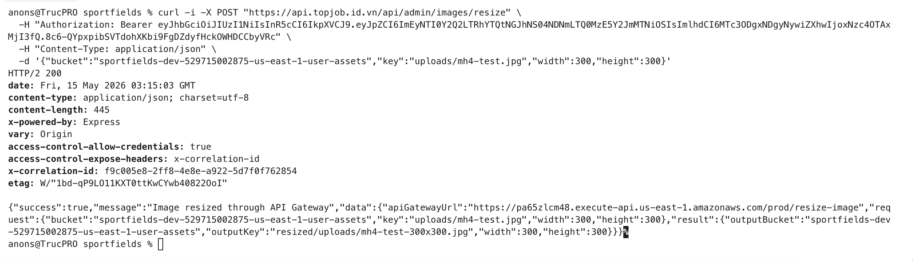

Backend endpoint `POST /api/admin/images/resize` chạy trên EC2 và gọi API Gateway bằng HTTPS URL + `x-api-key`.

### 8. Lambda CloudWatch Success Log & S3 Output

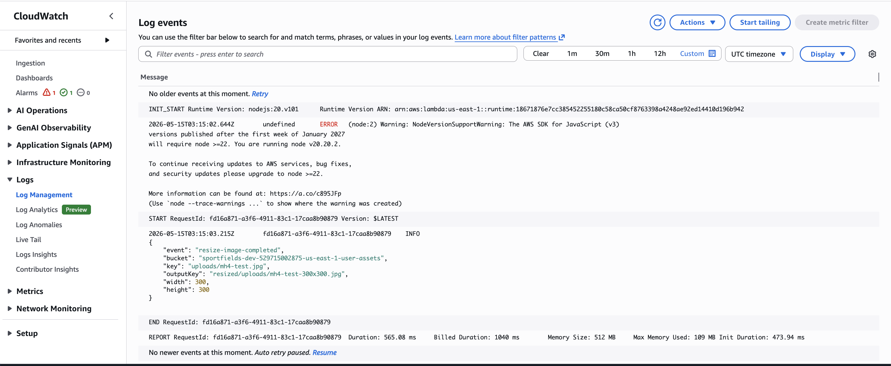

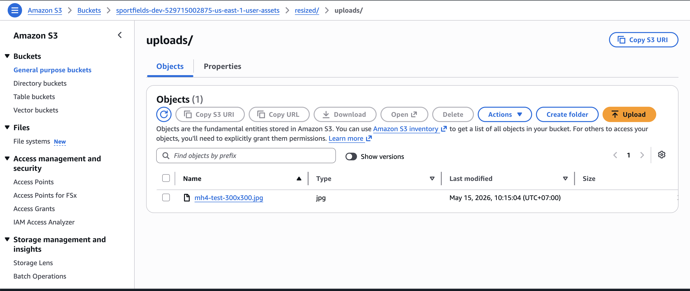

```
s3://sportfields-dev-529715002875-us-east-1-user-assets/resized/...
```

---

## MH5 — Scaling Pattern

📄 **Chi tiết đầy đủ:** [MH5_evidence.md](../W5/MH5_evidence.md)

**Pattern đã chọn:** Reserved Concurrency trên Lambda `sportfields-dev-resize-image`

### Rationale

Lambda Resize Image là function thật đang xử lý avatar profile. Image processing có thể tăng tải đột biến nếu nhiều user upload cùng lúc. Reserved Concurrency = 10 giới hạn số concurrent invocations, tránh workload resize dùng hết account concurrency.

### 1. Lambda Reserved Concurrency

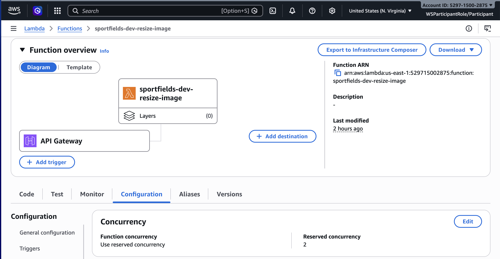

```
Function:             sportfields-dev-resize-image
Reserved concurrency: 10
```

### 2. Parallel Invocation Test

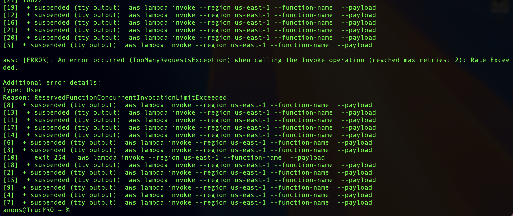

```
20 direct Lambda invokes chạy song song
-> Một số invoke thành công
-> Một số invoke bị TooManyRequestsException / throttled
```

### 3. CloudWatch Throttles Metric

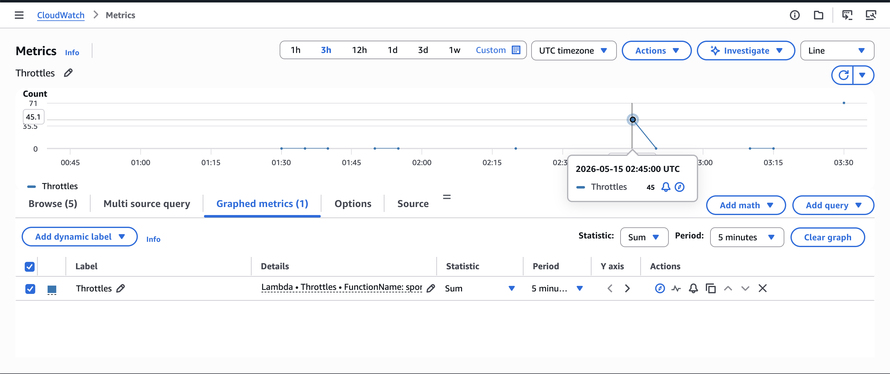

```
Namespace:   AWS/Lambda
FunctionName: sportfields-dev-resize-image
Metric:      Throttles
Statistic:   Sum
Datapoint:   > 0
```

### 4. Successful Resize After Throttle

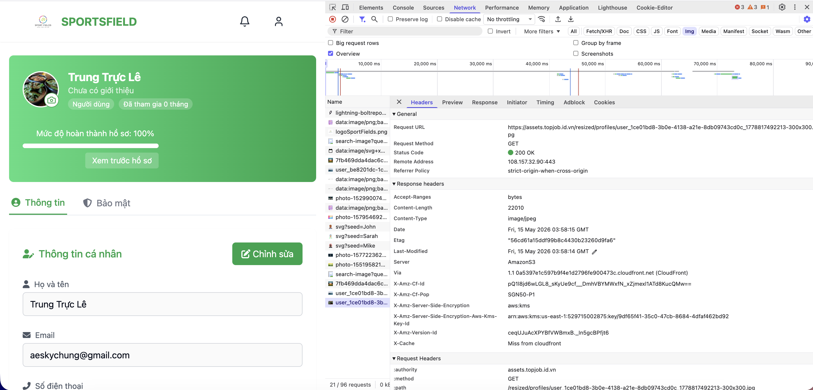

### 5. S3 Resized Avatar Object

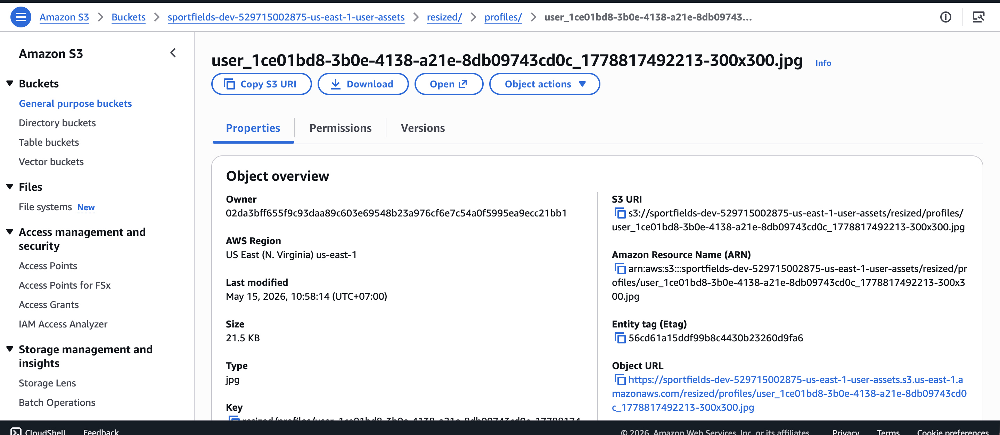

```
s3://sportfields-dev-529715002875-us-east-1-user-assets/resized/profiles/...
```

---

## Stretch Goal — API Gateway Custom Domain

📄 **Chi tiết đầy đủ:** [API_Gateway_custom_domain_evidence.md](../W5/API_Gateway_custom_domain_evidence.md)

**Custom domain:** `api-gw.topjob.id.vn`  
**Hosted zone:** `topjob.id.vn` / `Z001215534TG6WOOKP0BR`

### 1. ACM Certificate

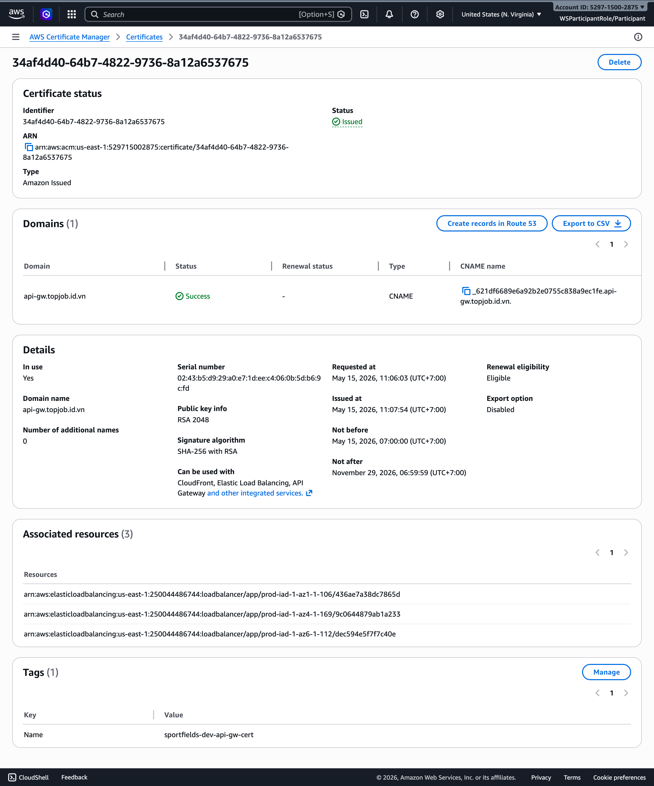

```
Domain:      api-gw.topjob.id.vn
ARN:         arn:aws:acm:us-east-1:529715002875:certificate/34af4d40-64b7-4822-9736-8a12a6537675
Status:      ISSUED
Region:      us-east-1
Validation:  DNS
```

### 2. API Gateway HTTP API

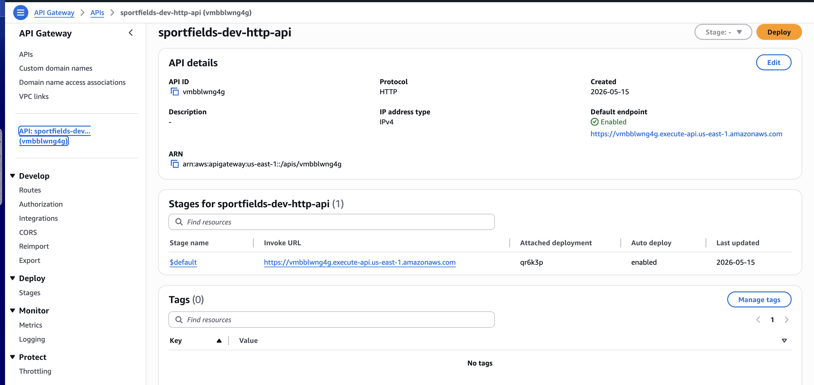

```
API name:   sportfields-dev-http-api
API ID:     vmbblwng4g
Protocol:   HTTP
Stage:      $default (auto deploy)
Integration: https://api.topjob.id.vn
```

### 3. Custom Domain

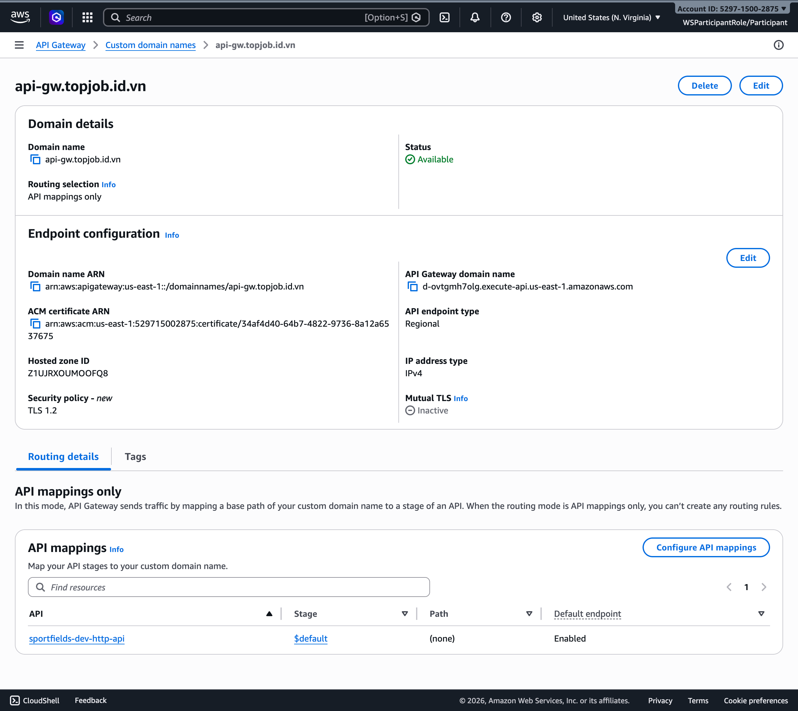

```
Custom domain:       api-gw.topjob.id.vn
Status:              AVAILABLE
Endpoint type:       REGIONAL
Security policy:     TLS 1.2
Regional domain:     d-ovtgmh7olg.execute-api.us-east-1.amazonaws.com
```

### 4. API Mapping & Route 53

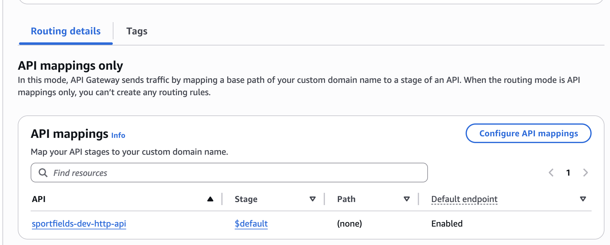

```
Domain:    api-gw.topjob.id.vn -> $default stage (root mapping)
```

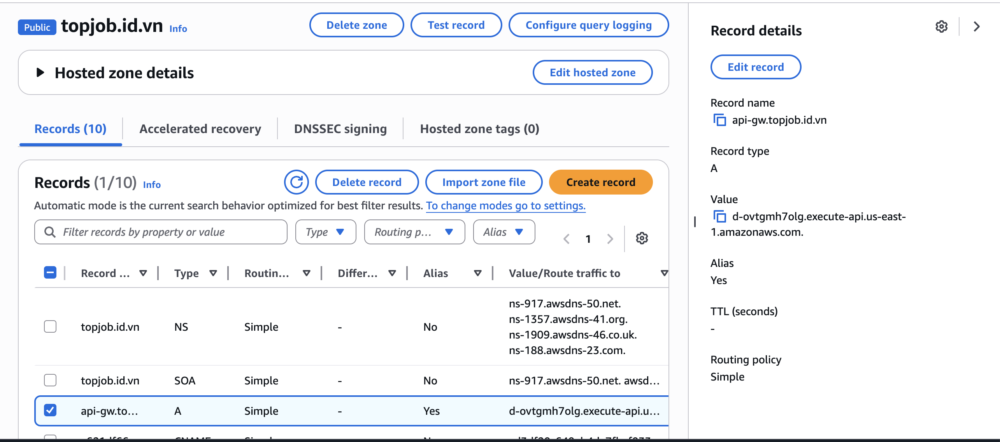

```
Record: api-gw.topjob.id.vn  A Alias -> d-ovtgmh7olg.execute-api.us-east-1.amazonaws.com
```

### 5. Test Custom Domain

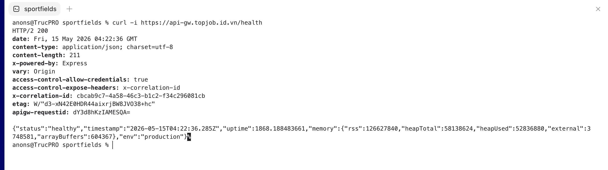

```bash
curl -i https://api-gw.topjob.id.vn/health
# HTTP/2 200
# apigw-requestid: dY1xTiN_IAMESgQ=
# {"status":"healthy", ..., "env":"production"}
```

Header `apigw-requestid` xác nhận request đi qua API Gateway, không gọi thẳng ALB.


## Negative Security Tests

### MH2 — Firewall Block

Test block outbound tới domain không có trong allowlist:

```bash
curl -I --max-time 10 https://example.com
# curl: (28) Connection timed out after 10002 milliseconds
```

Network Firewall drop packet, Alert Log ghi nhận `verdict.action: drop`.

### MH4 — API Gateway 403

Test không có API key:

```bash
curl -i -X POST "$RESIZE_IMAGE_API_URL" -H "Content-Type: application/json" -d '{...}'
# HTTP/2 403
```

### MH5 — Lambda Throttle

Test vượt Reserved Concurrency:

```bash
# 20 concurrent invokes -> TooManyRequestsException cho invoke vượt limit
# CloudWatch Throttles metric > 0
```
